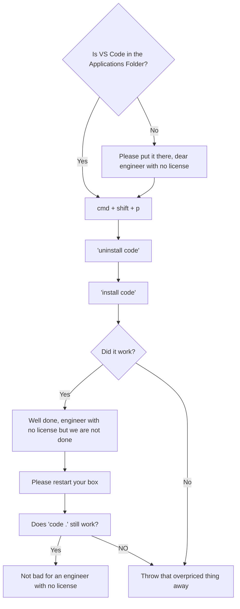

Estimated waste of time fixing this instead of doing your work: 30 mins to 1 hour

TLDR: Throw VS Code in the Applications Folder, uninstall code, reinstall code

---

---

  References because I did not come up with that (they didn't either but an engineer with no license needs validation hey)
  
  https://stackoverflow.com/questions/29955500/code-is-not-working-in-on-the-command-line-for-visual-studio-code-on-os-x-ma

  https://stackoverflow.com/questions/69004740/vs-code-denied-permission-unlink-usr-local-bin-code
